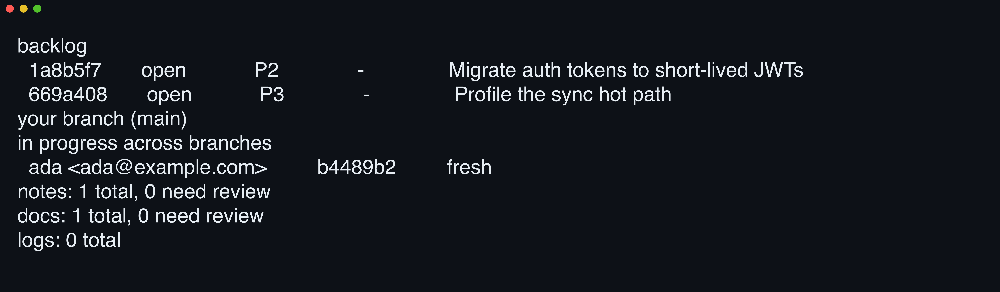

# 

**Delete your HANDOFF.md.** cc-notes keeps agent tasks, notes, and docs as a CRDT op-log on `refs/cc-notes/*`, synced over your existing git remote and invisible to checkout and diff.

[](https://github.com/yasyf/cc-notes/actions/workflows/ci.yml)
[](https://github.com/yasyf/cc-notes/releases)
[](LICENSE)

## Get started

```bash
brew install yasyf/tap/cc-notes
cc-notes init
```

`init` installs the `refs/cc-notes/*` refspecs and wires up whatever the repo is ready for: the Claude Code plugin and capt-hook pack when `.claude/` exists, the reconcile CI workflow when `.github/` does (`--no-ci` to skip). From then on `cc-notes status` is the board — here it is in a fresh session, everything on it served from hidden refs with zero files in the checkout:



Driving with an agent? Paste this:

```text
/plugin marketplace add yasyf/cc-notes
/plugin install cc-notes@cc-notes
```

The plugin auto-installs the binary on its first session, and with the capt-hook pack enabled the agent keeps refs shared on its own — `cc-notes sync` after a commit or a claim, `cc-notes reconcile` then a sync after a merge or pull.

<details>
<summary>Not on Claude Code? Paste this prompt instead.</summary>

```text
Install cc-notes with `brew install yasyf/tap/cc-notes`, then run `cc-notes init` in this repo.
Record each open work item with `cc-notes task add "<title>" --criterion "<how to verify it is done>" --backlog`, then `cc-notes sync` to share.
Run `cc-notes status` at the start of every session to orient; `cc-notes --help` covers the rest.
```

</details>

<details>
<summary>No Homebrew? Install script and platform binaries.</summary>

The install script picks the right binary for your platform, drops it in `~/.local/bin`, and verifies it against the release's `SHA256SUMS.txt`:

```sh
curl -fsSL https://raw.githubusercontent.com/yasyf/cc-notes/main/scripts/install.sh | sh
```

Both installers also install a `ccn` shorthand for `cc-notes`.

| Platform | Binary |
|---|---|
| macOS Apple Silicon | `cc-notes_darwin_arm64` |
| macOS Intel | `cc-notes_darwin_amd64` |
| Linux x86-64 | `cc-notes_linux_amd64` |
| Linux arm64 | `cc-notes_linux_arm64` |

</details>

---

## Use cases

### Hand off to the next session without a HANDOFF.md

The brief you leave in a loose file clutters every diff, and the next agent never opens it. Store it as a doc with a `--when` trigger naming the moment it matters — check out a prefilled buffer, write the brief in, and apply:

```bash
p=$(cc-notes doc add "Rollout order for the JWT swap" --checkout --when "picking up the auth migration")
# write the rollout steps into $p below the frontmatter, then:
cc-notes doc add --apply "$p"
```

When that moment arrives, `cc-notes relevant <path>` ranks the doc alongside notes and the read-time hooks float its pointer — title, trigger, and a `doc show` hint — while the long body stays out of the context window. Nothing touches the working tree.

### Run parallel agents on one backlog without double-claiming

Two agents grab the same backlog item and burn an afternoon on duplicate work. Claiming goes through a deterministic first-wins rule instead:

```bash
cc-notes task start 1662ec5
```

The winner holds the claim on its branch plus a lease that any edit refreshes; the loser gets `conflict: 1662ec5 already claimed by ada <ada@example.com> (in_progress)`. When a claimant dies, `cc-notes task stale` lists leases idle past the TTL (`cc-notes.leaseTTL` in git config) so another agent can reclaim.

### Keep recorded design facts from silently going stale

A fact written down in month one is confidently wrong by month three. Notes carry a freshness lifecycle, so ask for the ones needing attention:

```bash
cc-notes note review
```

Each hit comes back with a verdict:

```text
74408f8	2026-07-03	design	Auth tokens expire after 15 minutes	STALE
```

`note verify` re-attests a fact that still holds; `note supersede` replaces one that doesn't, keeping the lineage. Docs share the same lifecycle (`doc verify`, `doc supersede`, `doc expire`, `doc review`), so a handoff drifts loudly instead of silently.

### Land a verdict on a debugging hunch, not just a fix

A hunch chased across three sessions ends as a vague "fixed it" commit message, and the next regression starts the whole hunt over. An investigation holds the arc structurally: the premise is immutable, evidence appends to a timeline, and the status — never the title — carries the verdict:

```bash
cc-notes investigation open "TestPool deadlock on CI" "Hangs began after 3d55ae2e landed; suspect the pool rewrite."
cc-notes investigation append a1b2 "Bisect: hang reproduces at 3d55ae2e~4 too."
cc-notes investigation root-cause a1b2 "Unbuffered results chan leaks a blocked send on ctx cancel."
cc-notes investigation fix a1b2 --commit 5e3c9ce4
cc-notes investigation confirm a1b2 "20 green CI runs since the fix; no recurrence."
```

Status moves `open → root_caused → fixed → confirmed`; `exonerate` closes an arc whose premise turned out wrong — that is a verdict too — and `reopen` returns any closed one when it regresses. Findings (`investigation finding add`, then `clear` or `confirm --why`) hold each suspect hypothesis with its disposition, so a cleared suspect stays cleared.

---

## Commands

| Command | What it does |
|---|---|
| `cc-notes init` | Install refspecs; register the plugin and CI workflow when the repo is ready |
| `cc-notes status` | Read-only board: backlog, your branch's tasks, in-progress claims, notes needing review |
| `cc-notes task add` | Create a task (`--backlog` for the shared queue, `--criterion` for a validation gate) |
| `cc-notes task start` / `done` | Claim a task onto your branch; close it and anchor your HEAD commit |
| `cc-notes task validate` | Run a task's stored criterion scripts and record each as met or failed; `task done` gates on the criteria |
| `cc-notes note add` | Add a note, optionally anchored to a path, directory, commit, or branch |
| `cc-notes note review` | Flag notes as `DRIFTED`, `STALE`, or `UNVERIFIED` |
| `cc-notes doc add` | Store a long-form handoff with a `--when` trigger, surfaced to the next agent by `cc-notes relevant` |
| `cc-notes log add` | Start an append-only journal, surfaced by `cc-notes relevant`; logs skip the review lifecycle since they never drift |
| `cc-notes papercut` | File a one-paragraph friction complaint to the repo-wide papercuts journal (`papercut list` reads it back) |
| `cc-notes investigation open` | Open a debugging arc on a falsifiable premise; findings, an evidence timeline, and status verbs carry it to a verdict |
| `cc-notes runbook add` | Store a repeatable procedure as ordered steps; `runbook run start` tracks each execution with per-step outcomes |
| `cc-notes sprint` / `project` | Roll tasks up into the optional planning layer: time-boxed sprints, long-lived projects |
| `cc-notes relevant` | Rank the anchored records — notes, docs, logs, runbooks, investigations — most relevant to a path, with the reasons each matched |
| `cc-notes reconcile` | Carry merged branches' open tasks onto a target branch |
| `cc-notes blame` | Name the task(s) a commit implemented |
| `cc-notes attachment get` | Stream an attachment's content from the local LFS store (`path` prints its object path) |
| `cc-notes sync` | Push and pull `refs/cc-notes/*`, union-merging concurrent edits and transferring attachment content |
| `cc-notes viz` | Watch branch flow and note/task/doc lifecycles live in a browser |

Each noun carries a fuller verb set — `cc-notes <noun> --help` lists it, and the [CLI reference](plugin/skills/using-cc-notes/references/cli-reference.md) covers every flag. Docs and notes also edit as checked-out plain files: `doc edit <id> --checkout` (or `note edit`) renders the entity to Markdown and prints its path, and `--apply` commits your edits back. Tasks, sprints, projects, and runbooks carry threaded discussion via `<noun> comment`. Every mutation echoes the entity's new state as a tab-separated line, and every command takes `--json`. A global `--repo PATH` (`-R`) points any command at another repository's store from any cwd — pass any path inside it, while file-path arguments still resolve against the invocation cwd.

## MCP server

`cc-notes mcp` runs a stdio [Model Context Protocol](https://modelcontextprotocol.io) (MCP) server that mirrors the CLI surface: one `noun_verb` tool per agent-facing command across all eight entity kinds — `doc_add`, `note_edit`, `task_claim`, `task_criterion_met`, `investigation_open`, `runbook_run_done`, `sprint_add`, and the rest — with parity tests guarding both directions. Each tool drives the real CLI in-process, so it validates and returns exactly what the command does — a tool result is the command's `--json`. A long doc or note body rides the `body` parameter, so an agent records a handoff in one call, no scratch file and no stdin.

The Claude Code plugin wires the server for you: it ships a bundled `.mcp.json` pointed at the `cc-notes` on your `PATH`, and the tools surface as `mcp__plugin_cc-notes_cc-notes__<tool>`. Nothing to install or configure. The plugin also auto-approves cc-notes CLI and MCP calls, so agents are never permission-prompted for them. Recording a handoff is one tool call:

```json
{
  "tool": "mcp__plugin_cc-notes_cc-notes__doc_add",
  "arguments": {
    "title": "Rollout order for the JWT swap",
    "when": "picking up the auth migration",
    "body": "Ship the issuer first, then rotate refresh tokens."
  }
}
```

Setup and host-facing commands stay CLI-only — `init`, `gc`/`compact`, `viz`, `version`, the skills/hooks/workflows installers, and the `--checkout`/`--apply` file mode the `body` parameter replaces. If the binary is missing or predates this release, the server shows `failed` in `/mcp`, the session carries on, and the capt-hook nudges keep their CLI wording. To keep those hooks but switch the server off, add it to `deniedMcpServers` in your personal settings.

## Attachments

Notes, docs, and logs carry files — a profiler trace, a screenshot, a core dump — without bloating the repo's object database. `--attach` stores the reference (name, sha256, size) on the entity and the bytes in the standard git-lfs local store under `.git/lfs`; `cc-notes sync` then moves content through your host's LFS API in-process, so the `git-lfs` binary is never required. Attaching is fully offline; sync is the only network step.

```console
$ cc-notes log add "Perf investigation" --attach flamegraph.svg
f3ab90c	2026-07-02	-	Perf investigation

$ cc-notes attachment get f3ab90c flamegraph.svg -o /tmp/flamegraph.svg

$ cc-notes attachment path f3ab90c flamegraph.svg
/work/repo/.git/lfs/objects/9f/86/9f86d081884c7d659a2feaa0c55ad015a3bf4f1b2b0b822cd15d6c15b0f00a08
```

`log append --attach` adds files to an existing log, and `--attach` on `note edit` or `doc edit` attaches to a note or doc that already exists; a name that collides with a live attachment needs `--replace`. `--rm-attachment` on `note|doc|log edit` drops one, and `show` lists each attachment with a missing-locally marker until a sync fetches its bytes.

> [!WARNING]
> A plain `git push` publishes `refs/cc-notes/*` through the installed wildcard refspec **without** uploading attachment content — a fresh clone then holds references whose bytes 404 at sync. Only `cc-notes sync` holds the objects-before-refs invariant, uploading content before it pushes refs. In an attachment-carrying repo, share with `cc-notes sync`, never a bare `git push`.

Attachment content lives on your git host's LFS endpoint and counts against its LFS quotas — on GitHub, storage and bandwidth are [metered per repository owner](https://docs.github.com/en/repositories/working-with-files/managing-large-files/about-storage-and-bandwidth-usage). Removing the last reference (`--rm-attachment`, then sync) stops cc-notes from re-uploading an object, but GitHub only reclaims already-uploaded LFS storage when you delete the objects or the repository.

## Visualize

`cc-notes viz` opens a live web view of the current repo. Every branch draws as a swimlane with its fork and merge points, and every entity's lifecycle events — across all eight kinds, investigations and runbooks included — pin to the commits that produced them. Three tabs: the swimlane timeline, a commit DAG, and Browse — a faceted entity table with a task kanban, global search, and a markdown detail sidebar. All of them stream updates over SSE, so the view moves as agents claim, edit, and close work.

```bash
cc-notes viz
```

The command binds a loopback port, prints the URL, and opens your browser. `--port` pins the port, `--no-open` skips the browser, and `--poll` sets how often the server checks the refs for changes (default 2s). Release binaries ship the UI.

## How it works

Each entity is an event-log CRDT (conflict-free replicated data type) riding git as its transport — an approach pioneered by [git-bug](https://github.com/git-bug/git-bug). Mutations append kind-tagged ops to a per-entity op-log on a hidden ref; readers linearize and deterministically fold the log into the current snapshot, so concurrent edits union-merge instead of conflicting. Syncing rides plain git, and works under jj, where `cc-notes sync` drives git directly.

Release history lives in [CHANGELOG.md](CHANGELOG.md). Licensed under [PolyForm Noncommercial 1.0.0](LICENSE) — free for noncommercial use.
