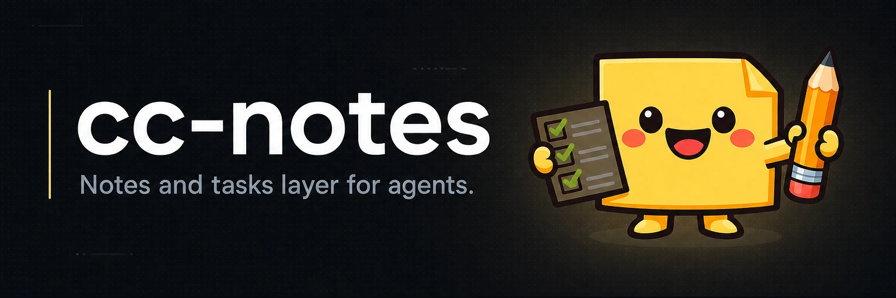

# cc-notes



[](LICENSE)

**Notes and tasks for AI agents, stored as objects in your repo's git database — no server, no sidecar, invisible in checkouts.**

Agents forget everything between sessions, and the usual fixes leak: a scratch file clutters your diffs, a tracker needs a server. cc-notes gives agents a durable place to write things down that travels with the repo, syncs on a plain `git push`, and never shows up in a checkout, a diff, or the GitHub UI.

## Install

```sh
brew install yasyf/tap/cc-notes
```

macOS and Linux. No Homebrew? The install script picks the right binary for your platform, drops it in `~/.local/bin`, and verifies it against the release's `SHA256SUMS.txt`:

```sh
curl -fsSL https://raw.githubusercontent.com/yasyf/cc-notes/main/scripts/install.sh | sh
```

Both prefer the FUSE-capable `_fuse` variant where it ships, which adds `cc-notes mount`, and install a `ccn` shorthand for `cc-notes` (the same binary, fewer keystrokes). You can also grab an asset (each release ships a `SHA256SUMS.txt`) from [GitHub Releases](https://github.com/yasyf/cc-notes/releases), or `go install github.com/yasyf/cc-notes/cmd/cc-notes@latest`.

Or just add the marketplace plugin: enabling `cc-notes@cc-notes` auto-installs the binary on its first session (Homebrew-preferred, the release download as fallback) via a bundled `SessionStart` hook, so adopting cc-notes is one step.

| Platform | Binary | With FUSE mount |
|---|---|---|
| macOS Apple Silicon | `cc-notes_darwin_arm64` | `cc-notes_darwin_arm64_fuse` |
| macOS Intel | `cc-notes_darwin_amd64` | `cc-notes_darwin_amd64_fuse` |
| Linux x86-64 | `cc-notes_linux_amd64` | `cc-notes_linux_amd64_fuse` |
| Linux arm64 | `cc-notes_linux_arm64` | — |

## Quickstart

Wire up a repo and run one task through its lifecycle in under five minutes. From any clone with a remote:

**1. Initialize.** `cc-notes init` installs the `refs/cc-notes/*` refspecs, and — when the repo has a `.claude/` directory — registers the cc-notes Claude Code plugin and enables its capt-hook pack; with a `.github/` directory it also installs the reconcile CI workflow (`--no-ci` to skip):

```console
$ cc-notes init
initialized: refs/cc-notes/* refspecs installed for origin
registered: cc-notes plugin in .claude/settings.json
```

**2. Capture work on the shared backlog.** Every mutation echoes the entity's new state as a tab-separated line:

```console
$ cc-notes task add "Add retry backoff to the API client" --backlog --priority 1 --label api --criterion "backoff caps at 30s"
d82c087	open	P1	-	Add retry backoff to the API client
```

**3. Claim it, then close it.** `task start` claims the task — deterministic first-wins — and moves it onto your current branch; `task done` closes it and anchors your HEAD commit:

```console
$ cc-notes task start d82c087
d82c087	in_progress	P1	ada <ada@example.com>	Add retry backoff to the API client
$ cc-notes task done d82c087
d82c087	done	P1	ada <ada@example.com>	Add retry backoff to the API client
```

**4. Drop a note anchored to the file it describes.** A note is born verified against the current HEAD:

```console
$ cc-notes note add "Auth tokens expire after 15 minutes" --path services/auth/login.go --tag design
ebba9fb	2026-06-12	design	Auth tokens expire after 15 minutes
```

**5. Publish to the remote.**

```console
$ cc-notes sync
pushed: 2
rounds: 1
```

Run `cc-notes status` any time for a read-only board: the shared backlog, your branch's open and in-progress tasks, every in-progress claim flagged fresh or STALE, and how many notes need review.

## Day-to-day use

**Tasks are global, agents coordinate through one remote.** A task is one flat ref at `refs/cc-notes/tasks/<id>` with a mutable `branch` attribute; `task add --backlog` puts it on the cross-agent queue any branch can see. `task start <id>` grabs a backlog item and moves it onto your branch in one step. Claims are deterministic first-wins — two agents racing for the same task before either syncs both fold to the same winner, never a corrupt double-claim.

**A claim opens a lease, so a crashed agent never locks work forever.** Any edit, comment, or `task renew` refreshes the heartbeat; `task stale` lists leases past the TTL and `task claim <id> --steal` reclaims one. Set the threshold with `cc-notes.leaseTTL` in git config, kept larger than your sync interval.

**Syncing rides plain git, and works under jj too.** After `init`, `git push` and `git pull` carry the refs alongside your branches. Under jj the git bridge moves only `refs/heads/*`, so `cc-notes sync` drives git directly and carries the cc-notes refs regardless.

**Merged tasks reconcile explicitly, never by hook.** After a merge, a merged branch's still-open tasks keep their old branch until `cc-notes reconcile --into <target>` carries them over — idempotent, safe to re-run, and wired into CI. It is a command, not a git hook, because jj fires no git hooks and would strand the merged branch's tasks.

**Commits link back to the task that built them.** Add a `cc-task: <id>` git trailer (or let `task done` anchor your HEAD); `cc-notes blame <sha>` reads the link back, naming the task a commit implemented.

**Notes stay honest because verification is first-class.** A note is a claim about the code, and claims decay. Re-confirm one with `note verify <id>`, record a replacement with `note supersede <old> --by <new>`, and run `note review` to surface decay — each flagged note tagged `DRIFTED` (an anchored path or commit changed), `STALE` (verified too long ago), or `UNVERIFIED`. The verdicts aren't stored; each reader computes them against a threshold, so they read identically across replicas. Anchor a note to a whole subtree with `note add --dir <dir>`: a directory anchor matches every file beneath it and drifts when anything under it changes.

**Notes find the agent before the agent looks.** `cc-notes relevant <path>` ranks the notes worth reading before touching a file — surfacing path and directory matches, notes on the current branch, work that merged into `HEAD`, siblings in the same directory, and a boost for files a teammate changed but you have not seen. Each result carries its score and the reasons it matched, so a hook can remind an agent of what it should already know.

## Commands

| Command | What it does |
|---|---|
| `cc-notes init` | Install refspecs; register the plugin and CI workflow when the repo is ready |
| `cc-notes status` | Read-only board: backlog, your branch's tasks, in-progress claims, notes needing review |
| `cc-notes task add` | Create a task (`--backlog` for the shared queue, `--criterion` for a validation gate) |
| `cc-notes task start` / `done` | Claim a task onto your branch; close it and anchor your HEAD commit |
| `cc-notes note add` | Add a note, optionally anchored to a path, directory, commit, or branch |
| `cc-notes note review` | Flag notes as `DRIFTED`, `STALE`, or `UNVERIFIED` |
| `cc-notes relevant` | Rank the notes most relevant to a path, with the reasons each matched |
| `cc-notes reconcile` | Carry merged branches' open tasks onto a target branch |
| `cc-notes blame` | Name the task(s) a commit implemented |
| `cc-notes sync` | Push and pull `refs/cc-notes/*`, union-merging concurrent edits |

Tasks also carry `list`, `ready`, `backlog`, `edit`, `comment`, `dep`/`undep`, `cancel`, `move`, `renew`, and `stale`; notes add `list`, `edit`, `search`, and `supersede`. An optional planning layer rolls tasks up into repo-wide sprints and projects via `cc-notes sprint` and `cc-notes project`, and `cc-notes task validate` runs each criterion's check script behind an explicit confirmation. Every note, task, sync, reconcile, and status command takes `--json`. Run `cc-notes <noun> --help` for the rest, or read the full [CLI reference](plugin/skills/using-cc-notes/references/cli-reference.md).

## How it works

Each entity is an event-log CRDT (conflict-free replicated data type) riding git as its transport — an approach pioneered by [git-bug](https://github.com/git-bug/git-bug). Mutations append kind-tagged ops to a per-entity op-log on a hidden ref; readers linearize and deterministically fold the log into the current snapshot, so concurrent edits union-merge instead of conflicting. cc-notes also ships a Claude Code plugin (marketplace `yasyf/cc-notes`, plugin `cc-notes@cc-notes`) whose `using-cc-notes` skill teaches an agent the workflow; `cc-notes init` registers it, and `cc-notes skills install` registers it on its own.

## Mount

With a `_fuse` binary, `cc-notes mount [DIR]` exposes everything as an editable filesystem — notes as Markdown, tasks, sprints, and projects as JSON. Mounting needs a FUSE implementation: `brew install macos-fuse-t/cask/fuse-t` on macOS, `fuse3` on Linux.

Run with no `DIR` and the mount is served at a managed per-repo default under `~/.cc-notes/mnt` and presented in the repo as a `.notes` symlink into it — `cd .notes` to browse. The symlink is kept out of git via `.git/info/exclude` (the tracked `.gitignore` is never touched), so the live mount stays out of the working tree: on macOS it is an NFS-backed fuse-t mount, which doesn't belong inside a checkout that `git status`, editors, and watchers walk. Pass an explicit `DIR` to serve there instead — it is created if absent and no symlink is made.

`mount` detaches by default — a background holder serves the mount, the command prints the path (`.notes` for the default, else `DIR`) and returns, and the mount persists after the command exits. Tear it down with `cc-notes mount --stop .notes` (or `--stop DIR`) or a plain `umount`; `--stop` and `--shutdown` remove the `.notes` symlink they created. `--list` and `--shutdown` drive the holder, and `--foreground` keeps the mount in the foreground where Ctrl-C unmounts.

## Development

Build with `CGO_ENABLED=0 go build ./...`; the FUSE variant needs cgo and `go build -tags fuse ./...`. Run the suite with `go test -race -count=1 ./...` — it passes with no network and no FUSE installed (mount tests skip themselves). Conventions live in [AGENTS.md](AGENTS.md), release history in [CHANGELOG.md](CHANGELOG.md).

## License

PolyForm-Noncommercial-1.0.0 © Yasyf Mohamedali — free for noncommercial use. See [LICENSE](LICENSE) or the [license text online](https://polyformproject.org/licenses/noncommercial/1.0.0).
